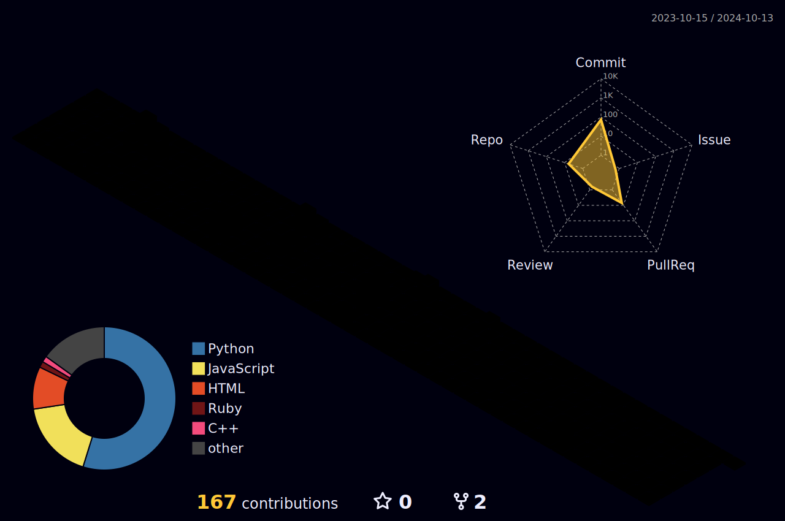

[](https://hits.seeyoufarm.com)

<p>🇰🇷</p>

<h3>Chanho Park</h3>

- 📫 How to reach me: charlieppark98@gmail.com or charlieppark@kaist.ac.kr
- 💭 Devlog : https://charlieppark.kr/

<h4>Education</h4>

<b>M.S in Graduate School of Metaverse, KAIST (Korea Advanced Institute of Science and Technology), Daejeon, South Korea (Mar.2024 ~)</b>

On leave of absence

&nbsp;

<b>BS in Mobile Systems Engineering, Dankook University, Yongin, South Korea (Mar.2018 ~ Aug.2023)</b>

GPA 4.27 / 4.5 (Major GPA 4.28 / 4.5), Top Rank

Full-funded Scholarship & Academic Excellence for all semesters


&nbsp;

<h4>Research Interest</h4>

[](https://)
&nbsp;
[](https://)
&nbsp;
[](https://)
&nbsp;
[](https://)

&nbsp;

<h4>Research Experience</h4>

<ul>
  <li><b>Undergraduate Intern in KAIST Visual AI Group</b>
  <ul>
    <li>Advisor Professor : Minhyuk Sung</li>
    <li>Jun. 2023 ~ Current</li>
    <li>Topics
    <ul>
      <li>Posterior Distiallation Sampling<br>
        Juil Koo, <b>Chanho Park</b>, Minhyuk Sung<br>
        <b>CVPR 2024</b><br>
        <a href="https://posterior-distillation-sampling.github.io/">Project Page</a><br><a href="https://arxiv.org/abs/2311.13831">Arxiv</a></li>
    </ul>
    </li>
  </ul>
  </li>
</ul>
&nbsp;
<ul>
  <li><b>Undergraduate Intern in Dankook University C&I Lab</b>
  <ul>
    <li>Advisor Professor : Kyu-haeng Lee</li>
    <li>Mar. 2021 ~ Jun. 2023</li>
    <li>Topics
    <ul>
      <li>Spammer node classification on large twitter graph using GCN with signed network analysis</li>
      <li>Weekly Paper Reading Seminar (2023 Jan ~ Mar)] (https://github.com/charlieppark/seminar_presentations)</li>
    </ul>
    </li>
  </ul>
  </li>
</ul>

&nbsp;

<h4>Honors & Awards</h4>
  
- Academic Excellence for all semesters. Full-funded Scholarship for all semesters.
- Won 2nd prize in <2022 Solar Electromagnetic Storm prediction AI contest> hosted by Korean Space Weather Center. Predicted solar storm using XGBoost, CNN, LSTM and stacking ensemble.
- Participated and finished with A grade in BISSIT program certificated by Brno University of Technology, Czech. Team leader of music genre classification service by using CNN, LSTM, XGBoost.
- Won silver prize at <Daou Tech Inc. programming contest> as a team leader and backend developer of <SimpleTeamUp> service, which helps people make teams for competitions.
- Won a bronze prize in <College of SW convergenge X College of Business & Economics Hackathon : 경소톤> as a web backend developer.
- Advanced to finals in <9th SW secure coding contest> of KISA as a backend developer

&nbsp;
  
&nbsp;



&nbsp;

<!--START_SECTION:waka-->

```txt
From: 24 November 2024 - To: 24 December 2024

Total Time: 0 secs

No activity tracked
```

<!--END_SECTION:waka-->

&nbsp;

[](https://github.com/anuraghazra/github-readme-stats)

&nbsp;

[](https://solved.ac/chanho0309)

&nbsp;

#### Badges

&nbsp;

<!--START_SECTION:activity-->
1. 💪 Opened PR [#2](https://github.com/KAIST-Visual-AI-Group/PDS/pull/2) in [KAIST-Visual-AI-Group/PDS](https://github.com/KAIST-Visual-AI-Group/PDS)
2. 💪 Opened PR [#6](https://github.com/63days/63days.github.io/pull/6) in [63days/63days.github.io](https://github.com/63days/63days.github.io)
3. 🎉 Merged PR [#5](https://github.com/63days/63days.github.io/pull/5) in [63days/63days.github.io](https://github.com/63days/63days.github.io)
4. 💪 Opened PR [#5](https://github.com/63days/63days.github.io/pull/5) in [63days/63days.github.io](https://github.com/63days/63days.github.io)
5. 🎉 Merged PR [#4](https://github.com/63days/63days.github.io/pull/4) in [63days/63days.github.io](https://github.com/63days/63days.github.io)
<!--END_SECTION:activity-->


<!--
**charlieppark/charlieppark** is a ✨ _special_ ✨ repository because its `README.md` (this file) appears on your GitHub profile.

Here are some ideas to get you started:

- 🔭 I’m currently working on ...
- 🌱 I’m currently learning ...
- 👯 I’m looking to collaborate on ...
- 🤔 I’m looking for help with ...
- 💬 Ask me about ...
- 📫 How to reach me: ...
- 😄 Pronouns: ...
- ⚡ Fun fact: ...
-->
